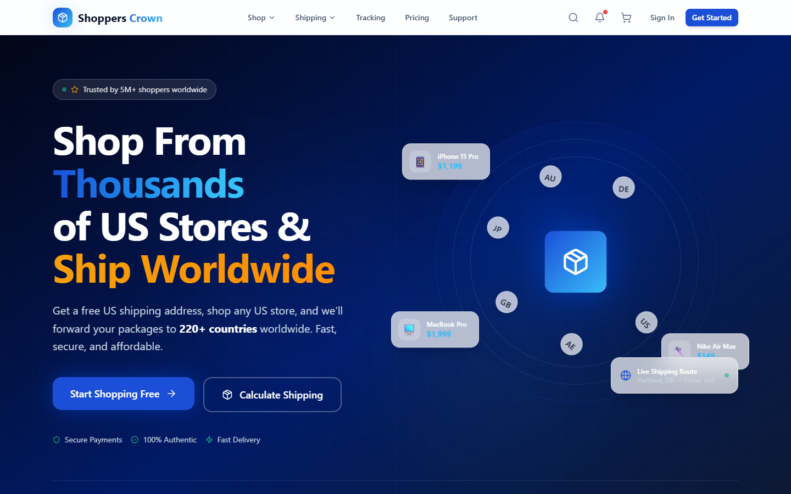
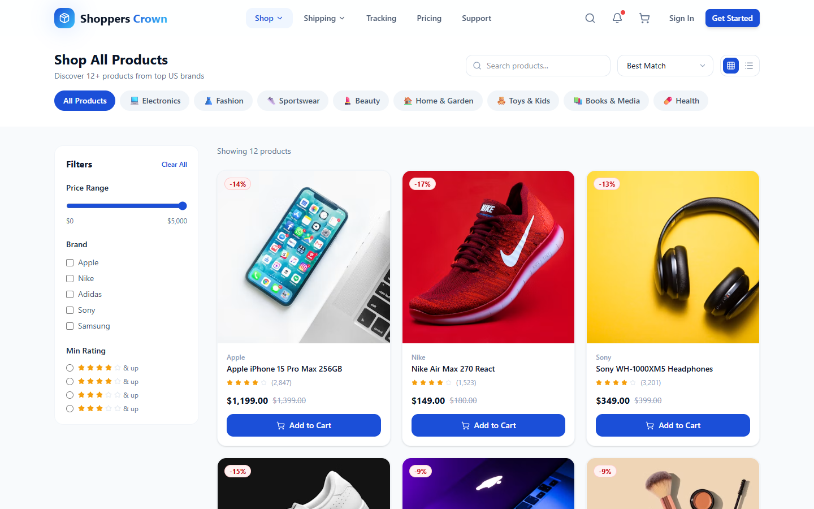
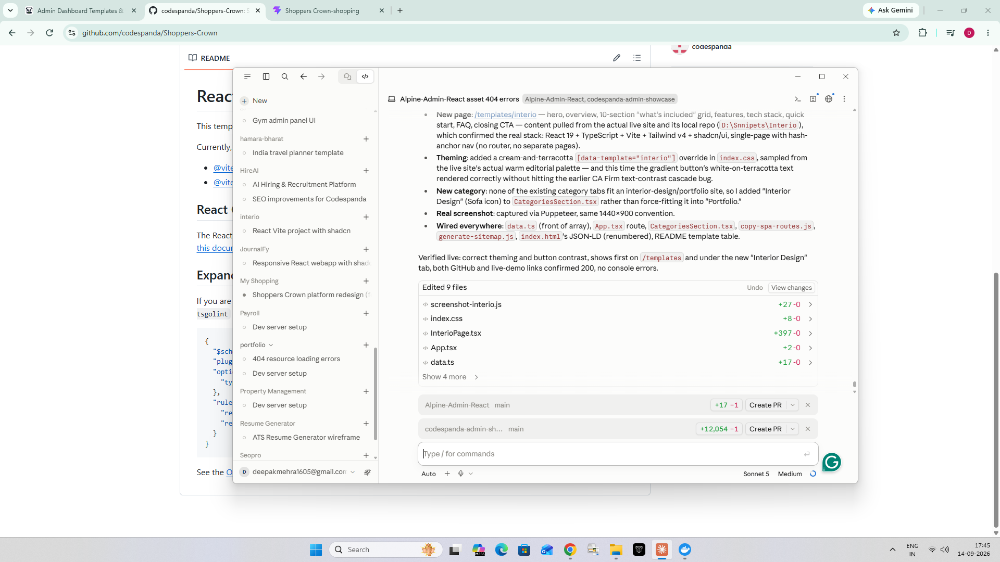
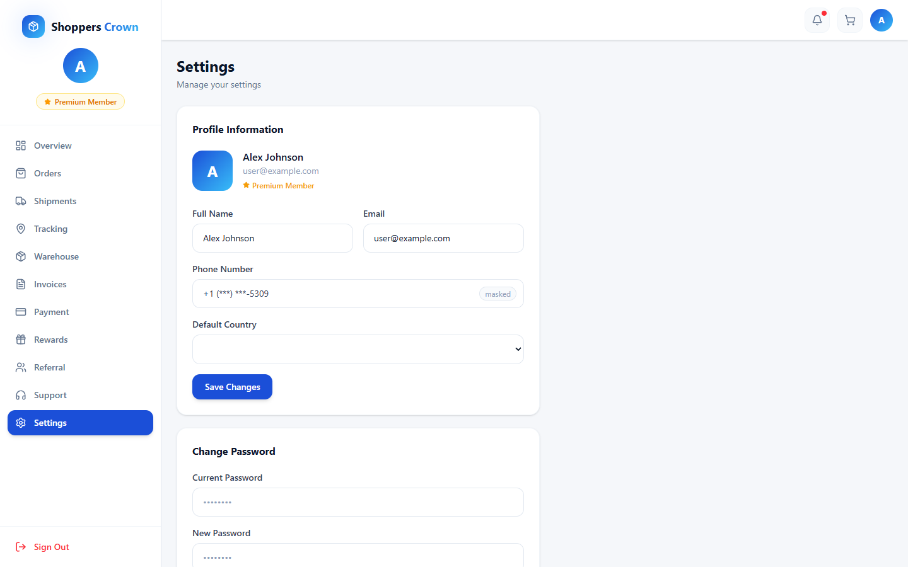
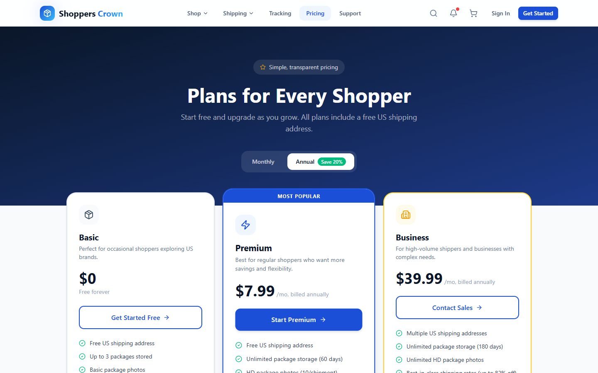
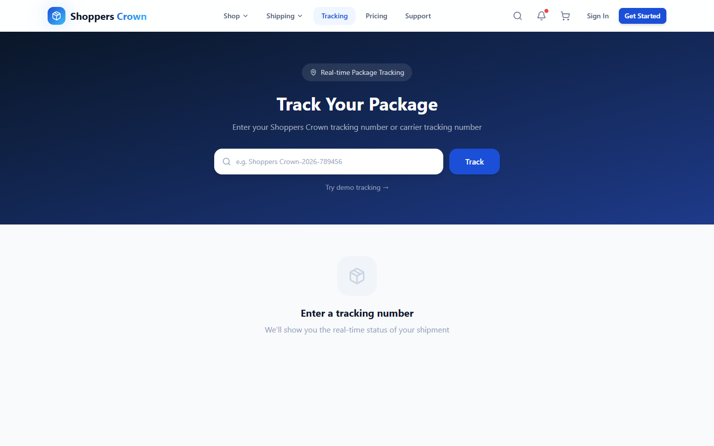
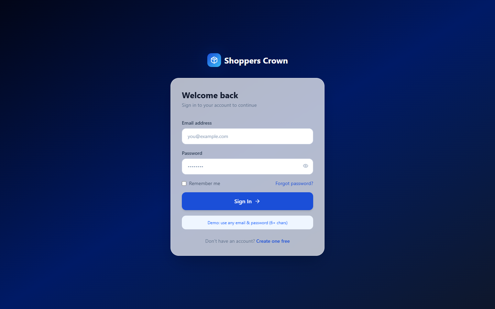
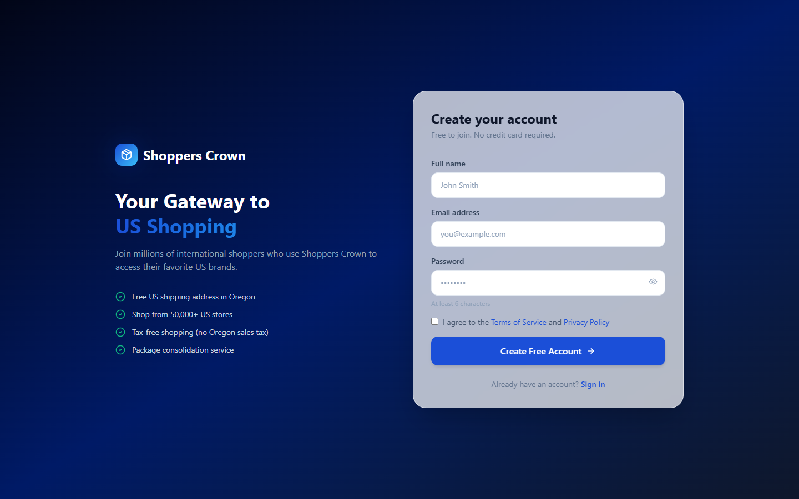

# 👑 Shoppers Crown

A modern international shopping & package-forwarding platform built with **React 19**, **TypeScript**, **Vite 8**, and **Tailwind CSS v4**.

> Shop from thousands of US stores and ship worldwide to 220+ countries.

---

## 📸 Screenshots

### 🏠 Homepage


### 🛍️ Shop — Product Listing


### 📊 Dashboard — Overview


### ⚙️ Dashboard — Settings


### 💎 Pricing Plans


### 📦 Package Tracking


### 🔐 Login


### 📝 Sign Up


---

## ✨ Features

- **Free US Address** — Instant personal US shipping address on signup
- **220+ Countries** — Ship worldwide at deeply discounted carrier rates
- **Package Consolidation** — Combine multiple orders into one shipment
- **Real-time Tracking** — End-to-end tracking from warehouse to door
- **Premium Dashboard** — Manage orders, shipments, invoices, rewards & referrals
- **Shipping Calculator** — Instant cost estimates before you buy
- **Phone Number Masking** — Privacy-first contact display throughout the app
- **Masked Settings Fields** — Sensitive data hidden at rest, revealed on focus
- **404 → Home Redirect** — All unknown routes redirect to homepage
- **Responsive Design** — Fully mobile-friendly at all breakpoints

---

## 🛠️ Tech Stack

| Technology | Version | Purpose |
|---|---|---|
| React | 19 | UI framework |
| TypeScript | 6 | Type safety |
| Vite | 8 | Build tool & dev server |
| Tailwind CSS | 4 | Utility-first styling |
| React Router | 7 | Client-side routing |
| Framer Motion | 12 | Animations & transitions |
| React Hook Form | 7 | Form state management |
| TanStack Query | 5 | Server state & caching |
| Lucide Icons | latest | Icon library |

---

## 🚀 Getting Started

### Prerequisites

- Node.js 18+
- npm

### Installation

```bash
git clone https://github.com/codespanda/Shoppers-Crown.git
cd shoppers-crown
npm install
npm run dev
```

Open [http://localhost:5173](http://localhost:5173) in your browser.

### Build for Production

```bash
npm run build
npm run preview
```

---

## 📁 Project Structure

```
shoppers-crown/
├── public/
│   └── favicon.svg
├── screenshots/              # App screenshots for README
├── src/
│   ├── components/
│   │   ├── layout/           # Navbar, Footer, Layout
│   │   ├── sections/         # Hero, FeaturedProducts, FAQ, CTA…
│   │   └── ui/               # Button, Input, Badge…
│   ├── context/              # AuthContext, CartContext, ThemeContext
│   ├── data/                 # mockData (products, brands, orders…)
│   ├── lib/                  # Utility helpers
│   ├── pages/                # Route-level page components
│   └── types/                # TypeScript interfaces
├── index.html
├── package.json
└── vite.config.ts
```

---

## 🔑 Demo Login

Use **any email** and **any password (6+ characters)** to sign in and explore the full dashboard.

---

## 📄 License

MIT © 2026 Shoppers Crown
